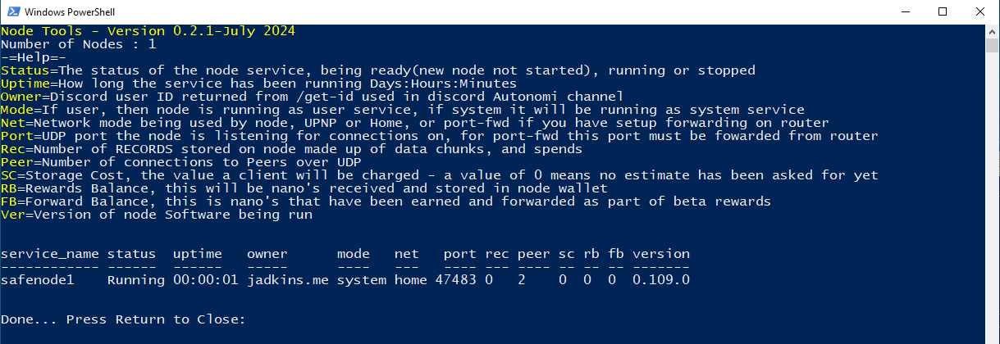
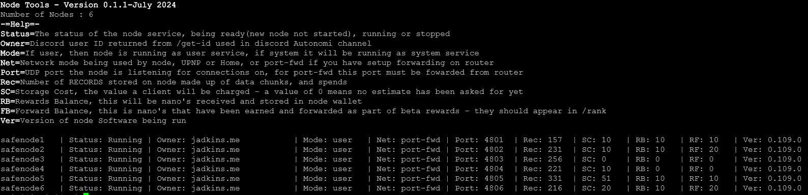

# node-tools

A simple utility to provide more information on the autonomi node, without requiring Vdash or Safenode-Manager to be installed.

## -= Install-Windows10 / 11 =-

The script uses Powershell, which is included on Windows 10 and 11 - you shouldn't need to install any other applications for the script to work.

Download the script from Github, to your downloads folder - click the link below, then in the Github Window select the `...` on upper right of screen above `history` - select `download`

[https://github.com/jadkins-me/NTracking/blob/main/node-tools/node-tools.ps1]

Locate the script `node-tools` in the `downloads` folder

right-click on it, and select `Run With Powershell`

*Note1:* You might get prompted with Windows execution exception, asking if you trust the script - the default is `N` - no, you will need to select `y` yes, else it might not work correctly.

*Note2:* Please don't try to run this with nodes created with safenode-manager, as some of the options needed by the script might fail - It should not be used where more than 50 nodes are running on a machine, as the script hasn't been tested above 50 and Y.M.M.V.

### Example Screen - Powershell


## -= Install-Linux =-

The utility needs some basic packages to function, you will need to install those first;

`sudo apt install parallel jq curl awk ps grep head sort`

### Running

The script is designed to run directly from github:

`curl -sSL "https://raw.githubusercontent.com/jadkins-me/NTracking/main/node-tools/node-tools.sh" | bash`

or you can install it locally with;

```
curl "https://raw.githubusercontent.com/jadkins-me/NTracking/main/node-tools/node-tools.sh"

mv node-tools.sh /usr/local/bin

chmod +x /usr/local/bin/node-tools.sh
```

to launch, just call `node-tools.sh`

### Usage

Node-tools reads the contents of the node_registry file created by autonomi safenode-manager and the node-launchpad.  It then passes this file, and displays information on the nodes being run on the machine.

#Note: If the nodes has a local metrics port enabled, the script will attempt to connect to this, to get more extended information.

The script will produce a table detailing the current status of the node, meanings for each column are below.

Status  =   This will be the current status of the node service, for the named instance i.e safenode1 - The values can be one of;
                    - Running - Node service is operational
                    - Stopped - Node service is stopped - you can try restarting with `safenode-manager start --service-name safenode1` or with node-launchpad
                    - Ready   - Node has been created, but has never been started.

Owner   =   This will be the discord ID for your account, if you particpate in the Beta rewards program.  It's worth noting this field is limited to 20 characters, so if you have a long discrod name, it will be cut short - this doesn't mean you have entered the wrong discord ID.  You can check the value for owner, by using the discobot in the autonomi discord channel - just use `/get-id ` and it will return your account ID you should use as owner.

Mode    =   When you use safenode-manager, or node-launchpad, the nodes that are created have to run against a service defination - this can be either user or system.  Both are valid, with `user` being the most restricted on access control and privaleges, to minimise impact on the system in the event of a security compromise.  While `system` is a global config, running at machine level, and will often be with elevated privaleges.

Net     =   This is the type of Network connection, the node is expecting to get/put peers on UDP on using Libp2p.  Just becuase these values are set, it doesn't mean they will work.  The options are UPNP, Home or port-fwd.

Port    =   This is the node port used for Libp2p connections on UDP.

Rec     =   *NOTE: This is a Metrics parameter - Number of RECORDS stored on node made up of data chunks, and spends

SC      =   *NOTE: This is a Metrics parameter - Storage Cost, the value a client will be charged - a value of 0 means no estimate has been asked for yet

RB      =   *NOTE: This is a Metrics parameter - Rewards Balance, this will be nano's received and stored in node wallet

FB      =   *NOTE: This is a Metrics parameter - Forward Balance, this is nano's that have been earned and forwarded as part of beta rewards - they should appear in /rank

Ver     =   Version of node Software being run

### Example Screen - Linux


